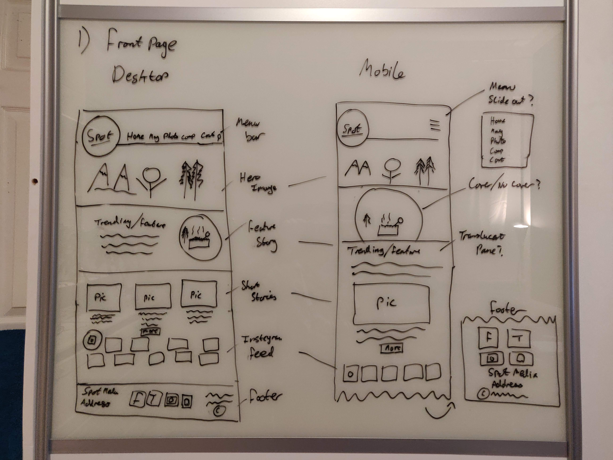
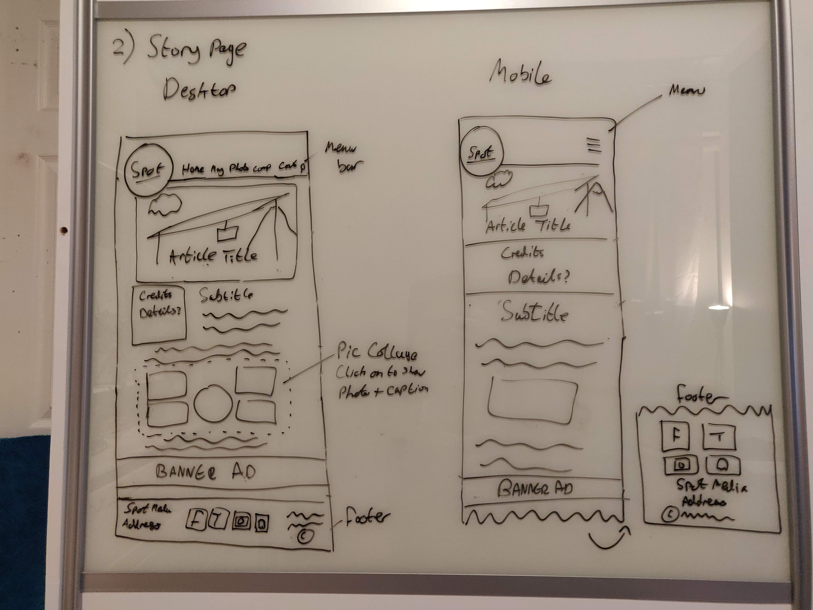
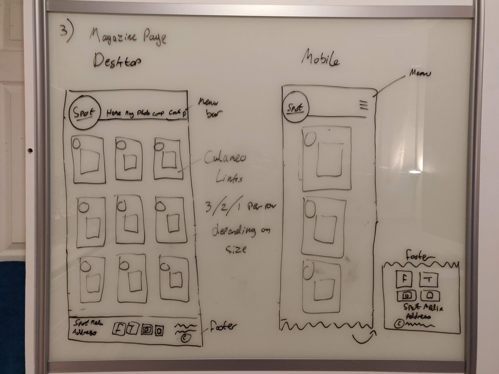
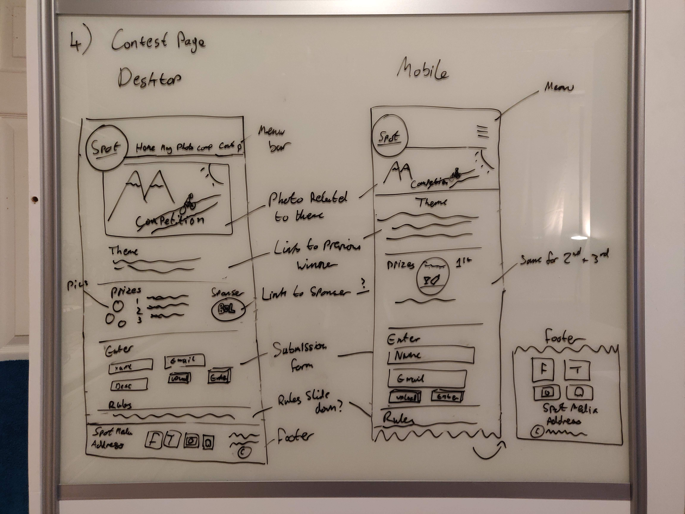
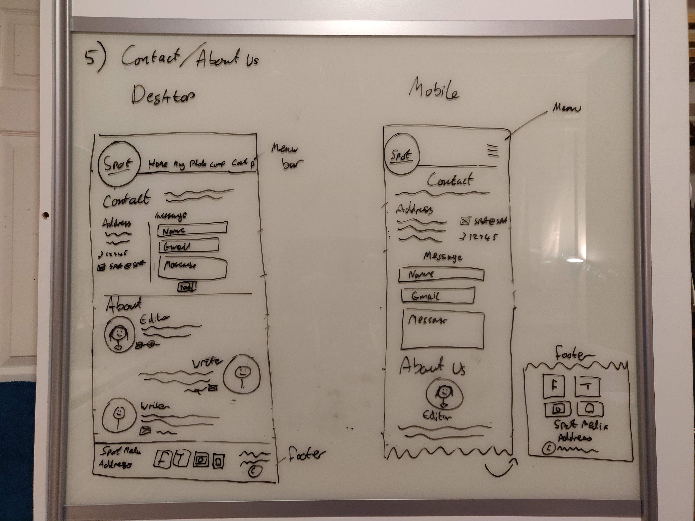

# Mockups

These are the initial design mockups from early in development integrating design ideas directly from the client and from the design reference websites she gave. At this stage in development I was awaiting feedback from the client so these mockups were not final. The idea for the tablet design of the site was that it would be half way between the mobile and the desktop version. It was not directly mocked up at this stage as I was waiting feedback and it did not make sense to design it if there were some elements the client might have wanted to change. In the end the client was quite happy with the designs so they did not change significantly during development but there were a few areas that she did have notes about. Details of these changes can be found below.

### Front Page

While not requested at first, later in development I suggested that the static Hero image at the top of the home page could be replaced by a carousel which was incorporated into the final design. The client also decided that it looked better if the circular image was not covered as if it was a layer behind the text.

### Story Page

The idea for the collage was that when an image was clicked it would expand into a lightbox popup but I did not realise at the time that it would require an extra JavaScript library so it was unfortunately not implemented. Also at first the idea was to have all extra information from the story be incorporated at the top of the page in the credits/details card. The client informed me that there can be quite a lot of information for some stories so the design was altered to include a tabbed information box at the bottom of the page.

### Magazine Page

There were no major changes between the design and the final product for this page.

### Contest Page

To help shorten the page on the mobile and tablet versions of the site a carousel was added to the design to showcase the prizes in one element rather than having them listed one after another. An accordion nav element was used to reveal the rules but rather than just having them expand as in the design, the form was added to the accordion, again to help reduce the length of the page.

### Contact/About Page

There were no major changes between the design and the final product for this page.